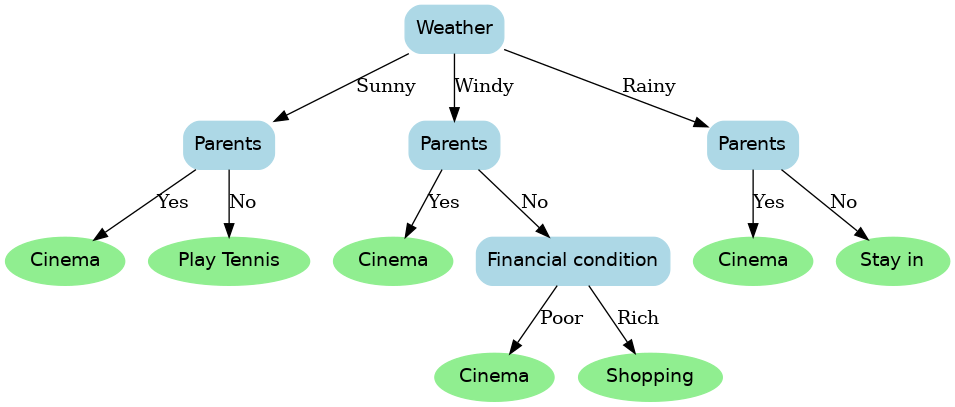
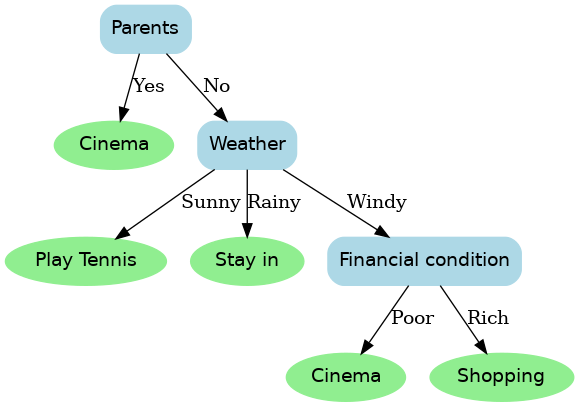

# 🎯 Attribute Selection Algorithm - Decision Trees

## 📌 Introduction

Decision Trees are one of the most widely used **supervised learning methods** for both **classification** and **regression** tasks.

They work by **recursively splitting** a dataset into smaller subsets based on attribute values, forming a **tree structure**:

- 🔹 **Internal Node** → Attribute test  
- 🔹 **Branch** → Outcome of the test  
- 🔹 **Leaf Node** → Class label or decision

A critical component of decision tree construction is the **Attribute Selection Algorithm**, which identifies the **best attribute** to split the dataset at each step. The selection is driven by **impurity measures** such as:

- Entropy  
- Information Gain  
- Gini Index  

---

## 📐 Formulas Used

### 1. 📊 Entropy
Entropy measures the **impurity or uncertainty** in a dataset. It is calculated as:

```
H(S) = − ∑ (pi * log₂(pi))
```
Where:  
- `pi` is the probability of class `i`  
- Summation runs over all possible classes

---

### 2. 📈 Information Gain
Information Gain measures the **reduction in entropy** after splitting on an attribute:

```
IG(S, A) = H(S) − ∑ (|Sv| / |S|) * H(Sv)
```

Where:  
- `S` = original set  
- `Sv` = subset for which attribute `A` has value `v`  
- `H(S)` = entropy of original set  
- `H(Sv)` = entropy of subset

---

### 3. ⚖️ Gini Index
The **Gini Index** is another measure of impurity:

```
Gini(S) = 1 − ∑ (pi²)
```

For a given attribute `A`, the **weighted Gini Index** is:

```
GiniIndex(S, A) = ∑ (|Sv| / |S|) * Gini(Sv)
```

---

## 📂 Dataset Used

| Weather | Parents | Financial Condition | Decision     |
|---------|---------|---------------------|--------------|
| Sunny   | Yes     | Poor                | Cinema       |
| Sunny   | No      | Rich                | Play Tennis  |
| Windy   | Yes     | Poor                | Cinema       |
| Windy   | No      | Poor                | Cinema       |
| Windy   | No      | Rich                | Shopping     |
| Rainy   | Yes     | Poor                | Cinema       |
| Rainy   | No      | Poor                | Stay in      |
| Rainy   | No      | Rich                | Shopping     |

---

## 🌳 Induced Graphs

### ✔️ Decision Tree using Entropy (Information Gain)



---

### ✔️ Decision Tree using Gini Index



---

## ✅ Summary

This project demonstrates how **attribute selection techniques** influence decision tree construction using **Entropy** and **Gini Index**. The graphical representations make it easier to interpret the decision paths.

---

## 📎 Files Included

- `Tree.py` → Python code implementing decision trees with entropy and gini  
- `Dataset.csv` → Training dataset  
- `tree_entropy.png` → Visualized decision tree using entropy  
- `tree_gini.png` → Visualized decision tree using Gini index  
- `README.md` → Project documentation